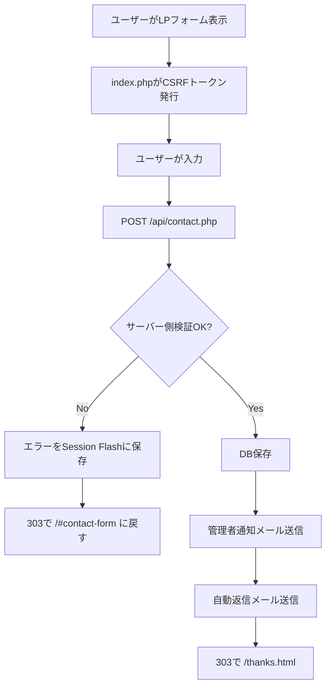

# DF CONNECT XServer完結 自前PHPフォーム 要件定義書・設計書

- 文書種別：要件定義書 / 基本設計書 / 詳細設計指示書
- 対象サイト：`https://dfconnect.jp/`
- 対象フォーム：DF CONNECT LP お問い合わせフォーム
- 想定実装者：Codex Spark
- 想定環境：XServer 共有サーバー / PHP 8系 / MySQLまたはMariaDB / PHPMailer
- 作成日：2026-05-10
- Version：1.1.0（外観完全維持方針を反映した最終版）

---

## 0. この文書の目的

本書は、DF CONNECT LPの問い合わせフォームを、Googleフォーム等の外部フォームサービスを使わず、XServer内で完結する自前PHPフォームとして実装するための要件定義書および設計書である。

Codex SparkにこのMarkdownを渡せば、仕様の解釈揺れを最小化して実装できる粒度を目標とする。

特に本最終版では、**既存LPの見た目を一切変更しないこと**を最上位制約として明文化する。今回の実装目的は、LPのデザイン改修ではない。目的は、既存のHTML/CSS/JS/assetsおよび視覚表現を維持したまま、フォームの送信処理だけをXServer上のPHP実装へ置き換えることである。

---

## 1. 最重要方針

### 1.1 絶対に守ること

- **既存LPの見た目は一切変更しない。**
- 本実装はデザイン改修ではない。フォーム送信処理の内製PHP化のみを目的とする。
- 既存のHTML構造、CSSクラス、余白、色、フォント、角丸、ボタンデザイン、レスポンシブ挙動、画像、アニメーション、JS挙動を原則そのまま維持する。
- 入力項目・選択肢は、現行要件のまま維持する。
- Googleフォーム、formrun、HubSpot、外部CRM、外部フォームAPIは使わない。
- フォーム処理、メール送信、DB保存はXServer上のPHPで完結させる。
- メール送信は `PHPMailer + XServerで作成したSMTPアカウント` を使う。
- 問い合わせ内容はMySQLまたはMariaDBに保存する。
- SMTPパスワード、DBパスワード、管理者メールアドレスなどの秘密情報をHTML、JS、Git管理対象ファイル、公開ディレクトリに直書きしない。
- サーバー側バリデーションを必須とする。フロント側バリデーションだけで完結させない。
- エラー詳細、SMTP認証情報、DB接続情報、スタックトレースを画面に表示しない。
- フォームUIを新規デザインし直さない。Bootstrap風、管理画面風、Googleフォーム風、素のHTMLフォーム風、AIが作った別UI風への変更は禁止する。
- 通常表示時、PHP化前後でユーザーが見た目の差分を認識できない状態を合格条件とする。

### 1.2 本書で明確化する重要な設計判断

| 論点 | 採用する判断 |
|---|---|
| 外観方針 | 既存LPの見た目を一切変更しない。デザイン改修・UI刷新・独自フォームUI化は禁止。 |
| 実装方針 | 既存LPをほぼそのまま `index.php` 化し、フォーム送信に必要なPHP処理だけを差し込む。 |
| 変更可能範囲 | `form` の `action` / `method`、各入力の `name`、hidden input、エラー表示領域、入力値再表示用PHP echo、アクセシビリティ属性の最小追加に限定する。 |
| CSS変更 | 原則禁止。追加する場合はhoneypot非表示、エラー表示、二重送信補助など機能上必要な最小限のみ。既存デザインの見た目を変えるCSSは禁止。 |
| LP本体の拡張子 | CSRFトークンを安全に発行するため、フォームを含むページは `index.php` 化することを推奨する。 |
| 既存URL | `https://dfconnect.jp/` のURLは維持する。`index.php` 化してもルートURL表示は変えない。 |
| 送信方式 | 通常のHTMLフォームPOST。Ajax必須にはしない。 |
| 確認画面 | 実装しない。入力 → POST → 成功時 `/thanks.html`。 |
| エラー時 | PRG方式でフォームへ戻し、セッションのFlashでエラーと入力値を再表示する。 |
| 成功時 | `303 See Other` で `/thanks.html` に遷移する。 |
| Bot判定時 | honeypotに値がある場合、メール送信・DB保存をせず、成功時と同じ `/thanks.html` に遷移する。 |
| 管理画面 | 初期実装では不要。DB保存後、phpMyAdmin等で確認できればよい。 |
| 自動返信 | 実装対象に含める。ただし管理者通知を最優先とし、自動返信失敗だけでは問い合わせ受付を失敗扱いにしない。 |

---

## 2. 前提・制約

### 2.1 サーバー前提

- XServerのサーバーパネルで対象ドメイン `dfconnect.jp` が設定済みであること。
- HTTPS化済みであること。
- PHP 8系が利用可能であること。
- MySQLまたはMariaDBのデータベースが作成可能であること。
- XServer上で `no-reply@dfconnect.jp` 等の送信用メールアカウントを作成できること。

### 2.2 XServer上で事前に準備するもの

| 種別 | 内容 | 備考 |
|---|---|---|
| PHP | PHP 8.2以上推奨 | 実際に利用可能なバージョンはサーバーパネルで確認する。 |
| DB | MySQLまたはMariaDB | DB名、DBユーザー、DBパスワード、DBホストを控える。 |
| メール | `no-reply@dfconnect.jp` | SMTPユーザー名は通常メールアドレス全体。 |
| SMTP | XServer SMTP | SSL/TLS 465を第一候補、STARTTLS 587を代替候補とする。 |
| composer | PHPMailer導入用 | サーバーで難しい場合はローカルで `composer install` 後にアップロードしてよい。 |

### 2.3 本番設定で禁止すること

- `display_errors = On` のまま本番公開すること。
- `phpinfo()` を公開ディレクトリに置くこと。
- `config/*.php`、`.env`、`schema.sql`、ログファイルを公開ディレクトリから直接閲覧できる状態にすること。
- 送信元Fromを問い合わせ者メールアドレスにすること。
- フロントJSだけでバリデーション・スパム対策を完結させること。
- CSRFトークンを静的HTMLに固定値で埋め込むこと。

---

## 3. スコープ

### 3.1 実装対象

- 既存LPフォームのPHP送信化。外観変更は禁止し、`action` / `method` / `name` / hidden input / エラー表示 / 入力値再表示の最小差分に限定する。
- `index.html` から `index.php` への移行。ただしHTML/CSS/JS/assetsは既存LPをほぼそのまま維持し、LPを作り直さない。
- CSRFトークン発行・検証
- honeypot実装
- PHPサーバー側バリデーション
- 短時間連投制限
- MySQL/MariaDBへの問い合わせ保存
- PHPMailerによる管理者通知メール送信
- PHPMailerによる問い合わせ者への自動返信メール送信
- `/thanks.html` の作成
- `/privacy.html` の作成
- `.htaccess` によるHTTPSリダイレクト、ディレクトリ一覧防止、機密ファイル保護
- `schema.sql` の作成
- 動作確認手順の作成

### 3.2 初期実装では対象外

- 管理画面
- CSVエクスポート画面
- ログイン機能
- ステータス更新UI
- CRM連携
- Slack / Chatwork / Discord 通知
- reCAPTCHA / hCaptcha
- 添付ファイルアップロード
- 確認画面
- 多言語対応

### 3.3 将来拡張として考慮するもの

- 管理画面
- 返信ステータス管理
- 商談ステータス管理
- Slack通知
- CSVダウンロード
- スパム判定強化
- IPブロックリスト
- メールテンプレート管理

### 3.4 外観維持スコープ

本実装において「触ってよいもの」と「触ってはいけないもの」を以下の通り定義する。

| 区分 | 方針 |
|---|---|
| HTML全体構造 | 原則維持。LPのセクション順、見出し、テキスト、画像、CTA、余白を変更しない。 |
| フォームDOM | 既存フォームDOMを優先。新規のフォームHTMLへ置き換えない。 |
| CSS | 原則維持。既存クラス名・スタイルを削除、上書き、再設計しない。 |
| JS | 原則維持。既存アニメーション、スクロール、メニュー、CTA挙動を壊さない。 |
| assets | 画像、フォント、アイコン、CSS/JSファイルの参照パスを変更しない。 |
| 通常表示 | PHP化前後で見た目の差分が出ないこと。 |
| エラー表示時 | エラーが出た時だけ必要な文言を表示してよい。ただし既存デザインに合わせる。 |

許可される最小変更：

```text
- index.html を index.php にする
- PHP bootstrap読み込みを追加する
- formタグに action="/api/contact.php" method="post" を設定する
- 各入力要素に本書指定の name 属性を設定する
- csrf_token hidden input を追加する
- honeypot用の非表示inputを追加する
- エラー表示領域を追加する。ただし通常時は表示されないこと
- 入力値再表示のために value / selected / checked / textarea 内へ PHP echo を入れる
- required、maxlength、autocomplete、aria-* などの属性を必要最小限で追加する
```

禁止される変更：

```text
- LP全体のHTMLを作り直す
- フォームを別デザインで再構築する
- 既存class名を削除・リネームする
- 既存CSSを大きく書き換える
- 余白、色、フォント、角丸、ボタンサイズ、レスポンシブ挙動を変更する
- CSSフレームワークを新規導入する
- 入力項目の見た目をGoogleフォーム風・Bootstrap風・管理画面風にする
- 既存のCTA、ファーストビュー、セクション構成、画像、コピーを変更する
```

---

## 4. フォーム項目要件

入力内容は現行要件から変更しない。

### 4.1 必須項目

| name属性 | ラベル | 種別 | 必須 | 備考 |
|---|---|---:|---:|---|
| `company` | 会社名 | text | 必須 | フリーランス等でも屋号・個人名入力を想定。 |
| `name` | お名前 | text | 必須 | 担当者名。 |
| `email` | メールアドレス | email | 必須 | 管理者通知のReply-To、自動返信先に使う。 |
| `inquiry_type` | 相談内容 | select | 必須 | 選択肢は固定。 |
| `message` | メッセージ | textarea | 必須 | 5000文字以内。 |
| `privacy` | プライバシーポリシー同意 | checkbox | 必須 | 値は `1` を想定。 |

### 4.2 任意項目

| name属性 | ラベル | 種別 | 必須 | 備考 |
|---|---|---:|---:|---|
| `company_type` | 会社区分 | select | 任意 | 空欄可。 |
| `response_style` | 希望の対応スタイル | select | 任意 | 空欄可。 |
| `desired_timing` | 希望時期 | select | 任意 | 空欄可。 |
| `budget_range` | 予算感 | select | 任意 | 空欄可。 |
| `nda` | NDA希望 | select | 任意 | 空欄可。 |
| `contact_method` | 希望の連絡方法 | select | 任意 | 空欄可。 |

### 4.3 hidden / bot対策項目

| name属性 | 用途 | 種別 | 必須 | 備考 |
|---|---|---:|---:|---|
| `website` | honeypot | text | 任意 | 人間には見せない。値があればBot扱い。 |
| `csrf_token` | CSRF対策 | hidden | 必須 | PHPセッションで発行・検証する。 |

---

## 5. 選択肢定義

選択肢はPHP側でもホワイトリストとして定義し、不正な値がPOSTされた場合はバリデーションエラーにする。

### 5.1 `company_type` 会社区分

```text
Web制作会社
広告代理店
デザイン会社
フリーランス
その他
```

### 5.2 `inquiry_type` 相談内容

```text
デザイン支給コーディング
WordPress制作・改修
LP / 下層ページ制作
運用保守・軽微修正
フォーム・CTA改善
公開前チェック
提案前の競合調査・資料作成補助
NDA / ホワイトラベル相談
デモサイトを見たい
その他
```

### 5.3 `response_style` 希望の対応スタイル

```text
完全裏方で依頼したい
必要時にMTG同席してほしい
要件整理から相談したい
まずは小さな修正を相談したい
まだ決まっていない
```

### 5.4 `desired_timing` 希望時期

```text
すぐ
1週間以内
1ヶ月以内
3ヶ月以内
未定
```

### 5.5 `budget_range` 予算感

```text
未定
〜3万円
3〜10万円
10〜30万円
30万円以上
継続相談
```

### 5.6 `nda` NDA希望

```text
希望する
必要に応じて
現時点では不要
```

### 5.7 `contact_method` 希望の連絡方法

```text
メール
オンラインMTG
どちらでも
```

---

## 6. フォームUI要件（外観完全維持）

### 6.1 最優先：既存LPの見た目を変えない

フォームUIは、既存LPのフォーム見た目をそのまま使う。

Codex Sparkは、フォームを「新しくデザインする」のではなく、**既存フォームの裏側にPHP送信処理を接続する**こと。

#### 6.1.1 通常表示時の絶対条件

- PHP化前後で、PC/SPともに通常表示の見た目が変わらないこと。
- 既存のHTML構造、CSSクラス、余白、色、フォント、角丸、ボタンデザイン、レスポンシブ挙動を維持する。
- 既存フォームの入力欄、ラベル、セレクト、テキストエリア、チェックボックス、ボタンの見た目を変えない。
- 既存フォームにある文言、配置、順序を勝手に変更しない。
- Bootstrap、Tailwind、独自CSSリセット、外部UIライブラリを新規導入しない。
- フォームUIをGoogleフォーム風、管理画面風、素のHTMLフォーム風に変更しない。

#### 6.1.2 変更してよい最小範囲

| 対象 | 変更可否 | 条件 |
|---|---:|---|
| `form` タグ | 可 | `action="/api/contact.php"`、`method="post"`、必要なら `novalidate` を追加するだけ。 |
| `name` 属性 | 可 | 本書指定の `name` に合わせる。見た目には影響させない。 |
| `id` 属性 | 原則維持 | 既存CSS/JS/label紐づけが壊れる可能性があるため、必要な場合のみ慎重に追加・調整する。 |
| `class` 属性 | 原則維持 | 既存classを削除・リネームしない。追加が必要な場合も既存デザインを壊さない。 |
| hidden input | 可 | `csrf_token` と honeypot のみ追加可。表示されないこと。 |
| エラー表示領域 | 可 | 通常時は非表示。エラー時のみ表示。既存デザインに合わせる。 |
| 入力値再表示 | 可 | `value` / `selected` / `checked` / textarea内にPHP echoを入れる。必ずエスケープする。 |
| CSS追加 | 最小限のみ可 | honeypot非表示、エラー表示、送信中状態など機能上必要なものだけ。通常表示を変えない。 |
| JS追加 | 最小限のみ可 | 二重送信防止など補助に限定。JS無効でも送信できること。 |

#### 6.1.3 ラベル・必須表示・任意表示

- 既存LP上にラベルや「必須」「任意」表示がある場合は、そのまま維持する。
- 既存LP上に表示がない場合、見た目を変える新規ラベル・バッジ追加は原則しない。
- アクセシビリティ上必要な関連付けは、既存デザインを崩さない範囲で `for` / `id` / `aria-*` を追加して対応する。
- `required`、`maxlength`、`autocomplete` は見た目に影響しないため追加してよい。

#### 6.1.4 スマホ表示

- 既存のレスポンシブ挙動を維持する。
- フォームPHP化により、SP表示で幅、余白、折り返し、ボタンサイズ、入力欄高さが変わってはいけない。
- エラー表示時のみ縦方向の高さが増えることは許容する。

### 6.2 送信ボタン文言

既存LPに送信ボタン文言がある場合は、**既存文言を維持する。**

未実装または文言未定の場合のみ、以下を第一候補とする。

```text
対応可否を相談する
```

代替可：

```text
外注相談を送信する
```

注意：送信ボタン文言の変更もユーザーから見える変更であるため、既存LPに文言が存在する場合はCodex Sparkが勝手に変更してはならない。

### 6.3 フォーム補足文

既存LPに同等の補足文がある場合は、そのまま維持する。

未実装または文言未定の場合のみ、以下を候補とする。

```text
クライアント名・案件詳細などの機密情報は、NDA締結後の共有でも問題ありません。
まずは概要のみでご相談ください。
```

注意：既存LPに補足文がない場合、Codex Sparkは勝手に表示要素を追加して通常表示の見た目を変えないこと。追加が必要な場合は、既存デザインのテキスト領域・余白・フォントに完全に合わせる。

### 6.4 プライバシー同意文

既存LPにプライバシーポリシー同意文がある場合は、既存の見た目と文言を原則維持する。

未実装または文言未定の場合のみ、以下を候補とする。

```text
プライバシーポリシーに同意のうえ送信します。
```

`プライバシーポリシー` は `/privacy.html` へリンクする。

注意：リンク追加・文言変更・チェックボックス配置変更は見た目に影響するため、既存要素がある場合は既存構造を優先する。

### 6.5 入力保持

エラー時は以下を満たす。

- 入力済みの値を再表示する。
- パスワード項目は存在しないため、全フォーム値を保持してよい。
- `privacy` チェック状態も保持してよい。
- `csrf_token` は再表示時に新しい値、または有効な値を再発行する。
- `website` honeypotは再表示時も空にする。

### 6.6 エラー表示

- 通常表示時は、エラー表示領域が見た目に影響しないこと。
- 既存LPにエラー表示用のスタイルやコンポーネントがある場合は、それを優先して使う。
- エラーがある場合、フォーム上部に概要を表示する。
- 各フィールド付近にも個別エラーを表示する。
- `aria-invalid="true"` と `aria-describedby` を適切に使う。
- エラー文言はユーザー向けの自然な日本語にする。
- システム内部エラー、SMTPエラー、DBエラーの詳細は表示しない。

### 6.7 二重送信対策UI

- 送信ボタン押下後、JavaScriptでボタンをdisabledにし、文言を `送信中...` に変えてよい。
- ただしJavaScript無効でも送信できるようにする。
- サーバー側ではCSRFトークンとレート制限で二重送信を抑止する。

---

## 7. 画面遷移設計

### 7.1 通常送信フロー



### 7.2 エラー時フロー

- `contact.php` はエラー内容と入力値を `$_SESSION` に保存する。
- `contact.php` は `303 See Other` で `/#contact-form` に戻す。
- `index.php` はSession Flashからエラーと入力値を読み、フォームに反映する。
- 反映後、Flashデータは削除する。

### 7.3 honeypot Bot判定時フロー

- `website` に値がある場合、人間ではなくBotと判断する。
- DB保存しない。
- メール送信しない。
- Botに検知されたことを悟らせないため、正常時と同様に `/thanks.html` に遷移する。
- 必要なら `inquiry_attempts` に `result = bot` として記録する。ただし問い合わせ本文は保存しない。

### 7.4 成功後遷移

```text
/thanks.html
```

リダイレクトステータス：

```text
303 See Other
```

理由：ブラウザ戻る・リロード時の再POSTを避けるため。

---

## 8. ファイル構成設計

### 8.1 推奨構成

可能な限り、設定ファイル、vendor、ログ、DBスキーマは `public_html` の外に置く。

```text
/home/<server-user>/
  dfconnect_app/
    app/
      bootstrap.php
      form_options.php
      helpers.php
      Validator.php
      InquiryRepository.php
      RateLimiter.php
      MailService.php
      Csrf.php
    config/
      app.example.php
      app.php              # 本番値。Git管理禁止。
      db.example.php
      db.php               # 本番値。Git管理禁止。
      mail.example.php
      mail.php             # 本番値。Git管理禁止。
    database/
      schema.sql
    storage/
      logs/
        contact_error.log
    vendor/
      autoload.php
    composer.json
    composer.lock

  dfconnect.jp/
    public_html/
      index.php
      thanks.html
      privacy.html
      .htaccess
      api/
        contact.php
      assets/
        css/
          style.css
        js/
          main.js
```

### 8.2 public_html外に置けない場合の代替構成

XServerの運用都合で `public_html` 外に配置できない場合のみ、以下のようにする。

```text
public_html/
  index.php
  thanks.html
  privacy.html
  .htaccess
  api/
    contact.php
  assets/
    css/
    js/
  private/
    app/
    config/
    database/
    storage/
    vendor/
    .htaccess
```

`public_html/private/.htaccess` には必ず以下を置く。

```apache
Require all denied
```

古いApache互換が必要な場合のみ、以下も併記する。

```apache
Order allow,deny
Deny from all
```

### 8.3 実装時の参照パス

`public_html/api/contact.php` からアプリ本体を読む例：

```php
require_once dirname(__DIR__, 2) . '/dfconnect_app/app/bootstrap.php';
```

実際のディレクトリ階層に合わせ、絶対パスまたは `dirname()` を使って安全に解決する。

---

## 9. index.php化の要件

### 9.1 なぜ index.php が必要か

CSRFトークンはセッションごとにランダム生成する必要がある。
静的な `index.html` に固定値の `csrf_token` を書く実装はNGである。

そのため、フォームを含むLPは以下のどちらかにする。

| 方式 | 可否 | 備考 |
|---|---:|---|
| `index.html` のまま固定CSRF値を埋め込む | NG | CSRF対策にならない。 |
| `index.php` にしてPHPでCSRF値を出力 | 推奨 | シンプルで堅い。 |
| `index.html` から `/api/csrf.php` をfetchする | 可 | Ajax依存が増えるため初期実装では非推奨。 |

本書では `index.php` 方式を採用する。

### 9.2 URL維持

- 既存のトップURL `https://dfconnect.jp/` は維持する。
- `index.html` と `index.php` が同時に存在する場合、サーバー設定により `index.html` が優先される可能性があるため注意する。
- 実装後は、旧 `index.html` を削除またはリネームする。
- `.htaccess` に `DirectoryIndex index.php index.html` を設定して、`index.php` を優先させる。

### 9.3 index.php化における外観維持手順

Codex Sparkは以下の順序で作業すること。

```text
1. 既存の index.html を外観基準として保持する。
2. index.html の内容をベースに index.php を作成する。
3. head、body、section、class、id、assets参照、既存JS読み込みを原則そのまま残す。
4. ファイル先頭にPHPのbootstrapとCSRF発行処理を追加する。
5. 既存フォームの form タグに action / method を追加する。
6. 既存入力要素に必要な name 属性を設定する。
7. csrf_token と honeypot を追加する。
8. old値再表示とエラー表示を差し込む。
9. 通常表示状態で、PHP化前と見た目が変わっていないことを確認する。
10. 問題なければ旧 index.html を退避または削除し、DirectoryIndexで index.php を優先する。
```

禁止：

```text
- 既存LPを新規テンプレートとして作り直す
- フォーム部分を汎用HTMLフォームに置き換える
- 既存class名を削除する
- CSSをリセットする
- 見た目の調整をCodex Sparkの判断で行う
```

---

## 10. .htaccess要件

`public_html/.htaccess` の基本方針：

- HTTPSへ統一する。
- ディレクトリ一覧を無効にする。
- `index.php` を優先する。
- 機密系拡張子の直接閲覧を拒否する。
- 可能ならセキュリティヘッダーを付与する。

例：

```apache
Options -Indexes
DirectoryIndex index.php index.html

RewriteEngine On
RewriteCond %{HTTPS} !on
RewriteRule ^(.*)$ https://%{HTTP_HOST}%{REQUEST_URI} [R=301,L]

<FilesMatch "\.(env|ini|log|sql|md|bak|dist)$">
  Require all denied
</FilesMatch>

<IfModule mod_headers.c>
  Header set X-Content-Type-Options "nosniff"
  Header set X-Frame-Options "SAMEORIGIN"
  Header set Referrer-Policy "strict-origin-when-cross-origin"
</IfModule>
```

注意：

- XServer上の他設定と競合する場合があるため、既存 `.htaccess` がある場合は上書きせず統合する。
- WordPressを併設している場合、WordPressのrewriteルールを壊さない。
- HSTSは影響が大きいため、初期実装では必須にしない。

---

## 11. 設定ファイル設計

### 11.1 `config/app.php`

```php
<?php
return [
    'env' => 'production',
    'debug' => false,
    'base_url' => 'https://dfconnect.jp',
    'admin_email' => 'your-admin@example.com',
    'admin_name' => 'DF CONNECT',
    'from_email' => 'no-reply@dfconnect.jp',
    'from_name' => 'DF CONNECT',
    'reply_to_name_suffix' => ' 様',
    'timezone' => 'Asia/Tokyo',
    'rate_limit_window_seconds' => 300,
    'rate_limit_max_attempts' => 3,
    'csrf_token_ttl_seconds' => 1800,
    'log_file' => __DIR__ . '/../storage/logs/contact_error.log',
];
```

### 11.2 `config/db.php`

```php
<?php
return [
    'dsn' => 'mysql:host=<xserver-db-host>;dbname=<db-name>;charset=utf8mb4',
    'username' => '<db-user>',
    'password' => '<db-password>',
    'options' => [
        PDO::ATTR_ERRMODE => PDO::ERRMODE_EXCEPTION,
        PDO::ATTR_DEFAULT_FETCH_MODE => PDO::FETCH_ASSOC,
        PDO::ATTR_EMULATE_PREPARES => false,
    ],
];
```

### 11.3 `config/mail.php`

```php
<?php
return [
    'host' => '<smtp-host>',
    'port' => 465,
    'encryption' => 'ssl',
    'username' => 'no-reply@dfconnect.jp',
    'password' => '<smtp-password>',
    'smtp_auth' => true,
    'charset' => 'UTF-8',
    'admin_subject' => '【DF CONNECT】お問い合わせがありました',
    'auto_reply_subject' => '【DF CONNECT】お問い合わせありがとうございます',
];
```

補足：

- SMTPホスト、ポート、暗号化方式はXServerのメールソフト設定画面で確認する。
- SSL/TLS 465を第一候補とする。
- 465で送信できない場合は、STARTTLS 587を試す。
- `username` は原則としてメールアドレス全体を使う。
- `from_email` とSMTP認証ユーザーのドメインは一致させる。

### 11.4 exampleファイルの運用

- `app.example.php`、`db.example.php`、`mail.example.php` はGit管理してよい。
- `app.php`、`db.php`、`mail.php` はGit管理しない。
- Codex Sparkは本番パスワードを仮値で生成しない。必ず `<smtp-password>` のようなプレースホルダーにする。

---

## 12. Composer / PHPMailer要件

### 12.1 composer.json

```json
{
  "require": {
    "phpmailer/phpmailer": "^6.9"
  }
}
```

### 12.2 PHPMailer基本設定

- `isSMTP()` を使う。
- `SMTPAuth = true`。
- `CharSet = 'UTF-8'`。
- `Encoding = 'base64'` を設定してよい。
- 管理者通知の `From` は `no-reply@dfconnect.jp`。
- 管理者通知の `Reply-To` は問い合わせ者メールアドレス。
- 自動返信の `To` は問い合わせ者メールアドレス。
- 自動返信に `Reply-To` を付ける場合は管理者メールまたは `no-reply` ではなく実返信可能なメールを使う。ただし初期実装では省略可。

### 12.3 mb_send_mailについて

- 初期実装では `mb_send_mail()` を主方式にしない。
- 到達率、認証、From整合性、エラーハンドリングを考え、PHPMailer + SMTPを採用する。
- どうしてもSMTPが使えない場合の緊急フォールバックとしてのみ検討する。

---

## 13. DB設計

### 13.1 テーブル一覧

| テーブル名 | 用途 | 初期実装で必要か |
|---|---|---:|
| `inquiries` | 問い合わせ本体の保存 | 必須 |
| `inquiry_attempts` | レート制限・Bot/失敗記録 | 必須 |

### 13.2 `inquiries` テーブル

問い合わせ内容を保存する。

```sql
CREATE TABLE inquiries (
  id BIGINT UNSIGNED NOT NULL AUTO_INCREMENT,
  public_id CHAR(32) NOT NULL,

  company VARCHAR(255) NOT NULL,
  name VARCHAR(100) NOT NULL,
  email VARCHAR(255) NOT NULL,
  company_type VARCHAR(100) DEFAULT NULL,
  inquiry_type VARCHAR(100) NOT NULL,
  response_style VARCHAR(100) DEFAULT NULL,
  desired_timing VARCHAR(100) DEFAULT NULL,
  budget_range VARCHAR(100) DEFAULT NULL,
  nda VARCHAR(50) DEFAULT NULL,
  contact_method VARCHAR(100) DEFAULT NULL,
  message TEXT NOT NULL,
  privacy_agreed TINYINT(1) NOT NULL DEFAULT 1,

  ip_address VARCHAR(45) DEFAULT NULL,
  user_agent VARCHAR(512) DEFAULT NULL,
  referrer VARCHAR(1024) DEFAULT NULL,

  status VARCHAR(50) NOT NULL DEFAULT 'new',
  admin_mail_status VARCHAR(20) NOT NULL DEFAULT 'pending',
  auto_reply_status VARCHAR(20) NOT NULL DEFAULT 'pending',
  admin_mail_sent_at DATETIME DEFAULT NULL,
  auto_reply_sent_at DATETIME DEFAULT NULL,

  created_at DATETIME NOT NULL DEFAULT CURRENT_TIMESTAMP,
  updated_at DATETIME NOT NULL DEFAULT CURRENT_TIMESTAMP ON UPDATE CURRENT_TIMESTAMP,

  PRIMARY KEY (id),
  UNIQUE KEY uq_inquiries_public_id (public_id),
  KEY idx_inquiries_email_created_at (email, created_at),
  KEY idx_inquiries_ip_created_at (ip_address, created_at),
  KEY idx_inquiries_status_created_at (status, created_at)
) ENGINE=InnoDB DEFAULT CHARSET=utf8mb4 COLLATE=utf8mb4_unicode_ci;
```

### 13.3 `public_id`

- 管理者メールやログに表示する問い合わせ識別子。
- `bin2hex(random_bytes(16))` で32文字の16進数文字列を生成する。
- 連番IDだけを外部メールに出さないことで推測を避ける。

### 13.4 `status` 想定値

```text
new：新規
replied：返信済み
meeting：商談化
estimated：見積提出
won：受注
lost：失注
ng：対象外・送信拒否等
```

初期実装では常に `new` で保存する。将来の管理画面で更新する。

### 13.5 `admin_mail_status` 想定値

```text
pending：送信前
sent：送信成功
failed：送信失敗
skipped：送信対象外
```

### 13.6 `auto_reply_status` 想定値

```text
pending：送信前
sent：送信成功
failed：送信失敗
skipped：送信しない
```

### 13.7 `inquiry_attempts` テーブル

レート制限判定と失敗記録に使う。

```sql
CREATE TABLE inquiry_attempts (
  id BIGINT UNSIGNED NOT NULL AUTO_INCREMENT,
  ip_address VARCHAR(45) DEFAULT NULL,
  email VARCHAR(255) DEFAULT NULL,
  result VARCHAR(30) NOT NULL,
  reason VARCHAR(100) DEFAULT NULL,
  created_at DATETIME NOT NULL DEFAULT CURRENT_TIMESTAMP,

  PRIMARY KEY (id),
  KEY idx_attempts_ip_created_at (ip_address, created_at),
  KEY idx_attempts_email_created_at (email, created_at),
  KEY idx_attempts_result_created_at (result, created_at)
) ENGINE=InnoDB DEFAULT CHARSET=utf8mb4 COLLATE=utf8mb4_unicode_ci;
```

`result` 想定値：

```text
success
validation_error
csrf_error
honeypot
rate_limited
db_error
admin_mail_failed
auto_reply_failed
method_not_allowed
```

注意：

- `inquiry_attempts` には問い合わせ本文を保存しない。
- PIIを最小限にするため、本文・会社名・名前は記録しない。
- レート制限目的でメールアドレスとIPのみ保存する。

---

## 14. バリデーション設計

### 14.1 共通処理

POST値は以下の順で処理する。

1. `$_POST` から期待するキーのみ取得する。
2. 文字列値は `trim()` する。
3. NULLバイトを除去する。
4. 改行コードを正規化する。
5. 文字数を `mb_strlen($value, 'UTF-8')` で確認する。
6. 必須項目を確認する。
7. メール形式を確認する。
8. select項目が許可済み選択肢に含まれるか確認する。
9. `privacy` が同意済みか確認する。
10. エラーがある場合、DB保存・メール送信は行わない。

### 14.2 文字数制限

| name属性 | 最大文字数 | 必須 | 補足 |
|---|---:|---:|---|
| `company` | 255 | 必須 | 空白のみ不可。 |
| `name` | 100 | 必須 | 空白のみ不可。 |
| `email` | 255 | 必須 | `filter_var` で検証。 |
| `company_type` | 100 | 任意 | 選択肢ホワイトリスト。 |
| `inquiry_type` | 100 | 必須 | 選択肢ホワイトリスト。 |
| `response_style` | 100 | 任意 | 選択肢ホワイトリスト。 |
| `desired_timing` | 100 | 任意 | 選択肢ホワイトリスト。 |
| `budget_range` | 100 | 任意 | 選択肢ホワイトリスト。 |
| `nda` | 50 | 任意 | 選択肢ホワイトリスト。 |
| `contact_method` | 100 | 任意 | 選択肢ホワイトリスト。 |
| `message` | 5000 | 必須 | 空白のみ不可。 |

### 14.3 必須チェック

以下が空の場合はエラー。

```text
company
name
email
inquiry_type
message
privacy
csrf_token
```

### 14.4 メール形式チェック

- `filter_var($email, FILTER_VALIDATE_EMAIL)` を使う。
- 文字数は255文字以内。
- CRLFを含むメールアドレスは拒否する。
- `Reply-To` に設定する前に必ず検証済みメールアドレスを使う。

### 14.5 select改ざん対策

任意項目でも、値が空ではない場合はホワイトリストに含まれている必要がある。

例：

```php
if ($companyType !== '' && !in_array($companyType, COMPANY_TYPE_OPTIONS, true)) {
    $errors['company_type'] = '会社区分の選択値が不正です。';
}
```

### 14.6 エラー文言

| 項目 | エラー条件 | 文言 |
|---|---|---|
| 会社名 | 空 | 会社名を入力してください。 |
| 会社名 | 255文字超過 | 会社名は255文字以内で入力してください。 |
| お名前 | 空 | お名前を入力してください。 |
| お名前 | 100文字超過 | お名前は100文字以内で入力してください。 |
| メール | 空 | メールアドレスを入力してください。 |
| メール | 形式不正 | メールアドレスの形式が正しくありません。 |
| メール | 255文字超過 | メールアドレスは255文字以内で入力してください。 |
| 相談内容 | 空 | 相談内容を選択してください。 |
| 相談内容 | 不正値 | 相談内容の選択値が不正です。 |
| メッセージ | 空 | メッセージを入力してください。 |
| メッセージ | 5000文字超過 | メッセージは5000文字以内で入力してください。 |
| プライバシー | 未同意 | プライバシーポリシーに同意してください。 |
| CSRF | 不正 | 送信内容の確認に失敗しました。お手数ですが、ページを再読み込みして再度お試しください。 |
| レート制限 | 超過 | 短時間に複数回送信されています。時間をおいて再度お試しください。 |
| システム | DB/メール失敗 | 送信に失敗しました。時間をおいて再度お試しください。 |

---

## 15. セキュリティ設計

### 15.1 必須セキュリティ要件

- POST以外のリクエストを拒否する。
- CSRFトークンを検証する。
- honeypotを実装する。
- 同一IPの短時間連投を制限する。
- 同一メールアドレスの短時間連投を制限する。
- メールアドレス形式を検証する。
- メールヘッダーインジェクションを防ぐ。
- HTML出力時は必ずエスケープする。
- DB保存はPDOのプリペアドステートメントを使う。
- SMTP/DBパスワードは公開しない。
- エラー詳細を画面に出さない。
- ログに問い合わせ本文やSMTPパスワードを出さない。
- フォームページに秘密情報を埋め込まない。

### 15.2 CSRF設計

#### 発行

- `index.php` 表示時にPHPセッションを開始する。
- セッションに `csrf_token` が存在しない、または期限切れの場合は新規発行する。
- トークンは `bin2hex(random_bytes(32))` で生成する。
- 発行時刻もセッションに保存する。
- hidden inputに出力する。

#### 検証

- `contact.php` でセッション内トークンとPOSTトークンを `hash_equals()` で比較する。
- トークンがない、不一致、期限切れの場合はエラー。
- 成功送信後はトークンを破棄する。
- エラー再表示時は新しいトークンを発行する。

#### TTL

```text
30分
```

### 15.3 セッションCookie設定

`session_start()` 前に以下相当を設定する。

```php
session_set_cookie_params([
    'lifetime' => 0,
    'path' => '/',
    'domain' => '',
    'secure' => true,
    'httponly' => true,
    'samesite' => 'Lax',
]);
```

注意：

- HTTPS運用が前提のため `secure => true` とする。
- 開発環境でHTTPを使う場合のみ一時的に `secure => false` としてよい。本番では戻す。

### 15.4 honeypot仕様

HTML：

```html
<div class="hp-wrap" aria-hidden="true">
  <label for="website">Website</label>
  <input type="text" id="website" name="website" tabindex="-1" autocomplete="off">
</div>
```

CSS：

```css
.hp-wrap {
  position: absolute;
  left: -9999px;
  width: 1px;
  height: 1px;
  overflow: hidden;
  opacity: 0;
}
```

PHP側：

```text
website に値がある場合、Botと判定する。
メール送信しない。
DB保存しない。
/thanks.html に遷移する。
```

### 15.5 レート制限仕様

#### 判定条件

```text
同一IPから5分以内に3回以上の送信試行がある場合は拒否。
同一メールアドレスから5分以内に3回以上の送信試行がある場合は拒否。
```

#### 対象

- 正常送信
- バリデーションエラー
- CSRFエラー
- honeypot
- メール送信失敗
- DB保存失敗

つまり、問い合わせ本体がDB保存されない失敗試行も `inquiry_attempts` に記録し、連投制限に使う。

#### 実装注意

- IPは `$_SERVER['REMOTE_ADDR']` を原則とする。
- `X-Forwarded-For` は簡単に偽装できるため、初期実装では信頼しない。
- メールアドレスは形式が正しい場合のみメール単位の制限に使う。
- レート制限エラー時は問い合わせ本体を保存しない。

### 15.6 XSS対策

- フォームに値を再表示する際は `htmlspecialchars($value, ENT_QUOTES, 'UTF-8')` を使う。
- 将来管理画面を作る場合も、DB保存値を表示するときは必ずエスケープする。
- メール本文はプレーンテキストとして組み立てる。
- HTMLメールは初期実装では使わない。

### 15.7 SQLインジェクション対策

- PDOを使う。
- SQLにはPOST値を直接連結しない。
- すべてプレースホルダーでbindする。
- `PDO::ATTR_EMULATE_PREPARES => false` を設定する。

### 15.8 メールヘッダーインジェクション対策

- `From` は固定値 `no-reply@dfconnect.jp` にする。
- 問い合わせ者メールを `From` にしない。
- `Reply-To` は検証済みメールアドレスのみ使う。
- `email` に `\r` または `\n` が含まれる場合は拒否する。
- PHPMailerを使い、生のヘッダー文字列を自作しない。

### 15.9 キャッシュ注意

`index.php` にCSRFトークンを埋め込むため、フォームページをHTMLキャッシュで固定化してはいけない。

- CDNを使う場合は `https://dfconnect.jp/` をキャッシュ対象から外す、またはCSRF部分を動的取得にする。
- XServer側のキャッシュ設定を使う場合も、フォーム送信テストでCSRFが正常に変わることを確認する。

---

## 16. メール設計

### 16.1 管理者通知メール

#### 送信条件

- バリデーションOK
- レート制限OK
- DB保存成功
- honeypotではない

#### 宛先

```text
From：DF CONNECT <no-reply@dfconnect.jp>
To：管理者メールアドレス
Reply-To：問い合わせ者メールアドレス
```

#### 件名

```text
【DF CONNECT】お問い合わせがありました
```

#### 本文テンプレート

```text
DF CONNECTのフォームからお問い合わせがありました。

問い合わせID：{public_id}
送信日時：{created_at}

------------------------------
会社名：{company}
お名前：{name}
メールアドレス：{email}
会社区分：{company_type}
相談内容：{inquiry_type}
希望の対応スタイル：{response_style}
希望時期：{desired_timing}
予算感：{budget_range}
NDA希望：{nda}
希望の連絡方法：{contact_method}
------------------------------

メッセージ：
{message}

------------------------------
IPアドレス：{ip_address}
User-Agent：{user_agent}
Referrer：{referrer}
------------------------------

このメールに返信すると、問い合わせ者のメールアドレス宛に返信されます。
```

### 16.2 自動返信メール

#### 送信条件

- 管理者通知メールが成功した後に送信する。
- 自動返信メールに失敗しても、管理者通知が成功していればフォーム送信自体は成功扱いとする。
- 自動返信失敗はログとDBの `auto_reply_status = failed` に残す。

#### 宛先

```text
From：DF CONNECT <no-reply@dfconnect.jp>
To：問い合わせ者メールアドレス
```

#### 件名

```text
【DF CONNECT】お問い合わせありがとうございます
```

#### 本文テンプレート

```text
{name} 様

この度はDF CONNECTへお問い合わせいただきありがとうございます。
内容を確認のうえ、通常1〜2営業日以内にご返信いたします。

なお、クライアント名・案件詳細などの機密情報は、NDA締結後の共有でも問題ありません。
まずは概要ベースで確認させていただきます。

送信内容：
--------------------
会社名：{company}
相談内容：{inquiry_type}
希望時期：{desired_timing}
メッセージ：
{message}
--------------------

DF CONNECT
```

### 16.3 メール送信失敗時の扱い

| 状況 | DB保存 | 管理者通知 | 自動返信 | 画面表示 |
|---|---:|---:|---:|---|
| DB保存失敗 | 失敗 | 送らない | 送らない | エラー |
| 管理者通知失敗 | 成功 | 失敗 | 送らない | エラー |
| 自動返信失敗 | 成功 | 成功 | 失敗 | 成功 |
| 両メール成功 | 成功 | 成功 | 成功 | 成功 |

理由：

- 管理者通知は問い合わせ受領の実務上必須である。
- DBに保存されていても管理者通知が届かなければ見落としリスクがあるため、管理者通知失敗時は成功ページに遷移しない。
- ただしDBには保存済みなので、ログとDBで復旧可能にする。

---

## 17. PHP処理設計

### 17.1 `index.php`

責務：

- セッション開始
- CSRFトークン発行
- Flashエラー取得
- old input取得
- フォームHTML出力
- 出力時エスケープ

疑似コード：

```php
require_once __DIR__ . '/../dfconnect_app/app/bootstrap.php';

$csrfToken = Csrf::getOrCreateToken();
$errors = Flash::get('errors', []);
$old = Flash::get('old', []);

// 既存LP HTMLを出力
// formのhidden csrf_token valueに $csrfToken を埋め込む
// 各input valueに $old をエスケープして反映
```

### 17.2 `api/contact.php`

責務：

- POST以外拒否
- セッション開始
- IP取得
- honeypot確認
- CSRF検証
- 入力取得・正規化
- レート制限確認
- バリデーション
- DB保存
- 管理者通知メール送信
- 自動返信メール送信
- 結果に応じたリダイレクト

処理順：

```text
1. bootstrap読み込み
2. POST以外なら405
3. セッション開始
4. 入力正規化
5. inquiry_attemptsに必要な最小情報を記録できる準備
6. honeypot確認
   - 値あり：attempt記録 result=honeypot → thanksへ
7. レート制限確認
   - 超過：attempt記録 result=rate_limited → フォームへ戻す
8. CSRF検証
   - NG：attempt記録 result=csrf_error → フォームへ戻す
9. バリデーション
   - NG：attempt記録 result=validation_error → フォームへ戻す
10. inquiriesへ保存
    - NG：attempt記録 result=db_error → フォームへ戻す
11. 管理者通知メール送信
    - NG：inquiries.admin_mail_status=failed、attempt記録 result=admin_mail_failed → フォームへ戻す
12. 自動返信メール送信
    - NG：inquiries.auto_reply_status=failed、attempt記録 result=auto_reply_failed。ただし成功扱い。
13. inquiriesのmail status更新
14. attempt記録 result=success
15. CSRFトークン破棄
16. thanksへ303リダイレクト
```

### 17.3 `Validator.php`

責務：

- 入力値の正規化
- 必須チェック
- 文字数チェック
- メール形式チェック
- selectホワイトリストチェック
- privacyチェック

戻り値例：

```php
[
  'valid' => true,
  'data' => [
    'company' => '...',
    'name' => '...',
    // ...
  ],
  'errors' => []
]
```

### 17.4 `InquiryRepository.php`

責務：

- `inquiries` へのINSERT
- メールステータス更新
- `inquiry_attempts` へのINSERT
- レート制限カウント取得

必ずPDOプリペアドステートメントを使う。

### 17.5 `RateLimiter.php`

責務：

- IP単位の試行回数を数える。
- メール単位の試行回数を数える。
- 5分以内3回以上なら拒否する。

SQL例：

```sql
SELECT COUNT(*) AS count
FROM inquiry_attempts
WHERE ip_address = :ip_address
  AND created_at >= (NOW() - INTERVAL 5 MINUTE);
```

メール単位：

```sql
SELECT COUNT(*) AS count
FROM inquiry_attempts
WHERE email = :email
  AND created_at >= (NOW() - INTERVAL 5 MINUTE);
```

### 17.6 `MailService.php`

責務：

- PHPMailerインスタンス生成
- SMTP設定
- 管理者通知メール送信
- 自動返信メール送信
- 件名・本文テンプレートの組み立て

注意：

- 1通ごとにPHPMailerインスタンスを分けるか、`clearAddresses()` / `clearReplyTos()` を確実に実行する。
- SMTPパスワードをログに出さない。
- 例外を捕捉して上位に安全なエラーとして返す。

---

## 18. HTMLフォーム改修方針・実装例

### 18.1 既存フォーム優先の原則

Codex Sparkは、以下のサンプルHTMLをそのまま既存LPへ置き換えてはならない。

既存LPにフォームHTMLが存在する場合は、そのHTML構造・class・id・見た目を優先し、必要な属性とPHP出力だけを差し込む。

最小差分のイメージ：

```html
<!-- 既存 -->
<form class="既存のclass" id="既存のid">

<!-- 変更後：class/idは維持し、action/methodだけ追加 -->
<form class="既存のclass" id="既存のid" action="/api/contact.php" method="post" novalidate>
  <input type="hidden" name="csrf_token" value="<?= h($csrfToken) ?>">
  <!-- honeypotは視覚的に表示されない位置に追加 -->
</form>
```

各入力欄も、既存class/id/DOMを維持したまま `name` と再表示用PHPを追加する。

```html
<!-- 既存 -->
<input class="既存のclass" id="company" type="text">

<!-- 変更後 -->
<input class="既存のclass" id="company" type="text" name="company" value="<?= h($old['company'] ?? '') ?>" maxlength="255" autocomplete="organization" required>
```

### 18.2 新規フォームHTMLが必要な場合のみの参考実装

以下は、既存LPにフォームHTMLが存在しない場合の参考実装である。既存フォームがある場合は使用しない。

```html
<form class="contact-form" id="contact-form" action="/api/contact.php" method="post" novalidate>
  <input type="hidden" name="csrf_token" value="<?= h($csrfToken) ?>">

  <div class="hp-wrap" aria-hidden="true">
    <label for="website">Website</label>
    <input type="text" id="website" name="website" tabindex="-1" autocomplete="off">
  </div>

  <div class="form-field">
    <label for="company">会社名 <span class="required">必須</span></label>
    <input type="text" id="company" name="company" value="<?= h($old['company'] ?? '') ?>" maxlength="255" autocomplete="organization" required>
  </div>

  <div class="form-field">
    <label for="name">お名前 <span class="required">必須</span></label>
    <input type="text" id="name" name="name" value="<?= h($old['name'] ?? '') ?>" maxlength="100" autocomplete="name" required>
  </div>

  <div class="form-field">
    <label for="email">メールアドレス <span class="required">必須</span></label>
    <input type="email" id="email" name="email" value="<?= h($old['email'] ?? '') ?>" maxlength="255" autocomplete="email" required>
  </div>

  <div class="form-field">
    <label for="company_type">会社区分 <span class="optional">任意</span></label>
    <select id="company_type" name="company_type">
      <option value="">選択してください</option>
      <!-- optionsはPHPで出力 -->
    </select>
  </div>

  <div class="form-field">
    <label for="inquiry_type">相談内容 <span class="required">必須</span></label>
    <select id="inquiry_type" name="inquiry_type" required>
      <option value="">選択してください</option>
      <!-- optionsはPHPで出力 -->
    </select>
  </div>

  <div class="form-field">
    <label for="response_style">希望の対応スタイル <span class="optional">任意</span></label>
    <select id="response_style" name="response_style">
      <option value="">選択してください</option>
      <!-- optionsはPHPで出力 -->
    </select>
  </div>

  <div class="form-field">
    <label for="desired_timing">希望時期 <span class="optional">任意</span></label>
    <select id="desired_timing" name="desired_timing">
      <option value="">選択してください</option>
      <!-- optionsはPHPで出力 -->
    </select>
  </div>

  <div class="form-field">
    <label for="budget_range">予算感 <span class="optional">任意</span></label>
    <select id="budget_range" name="budget_range">
      <option value="">選択してください</option>
      <!-- optionsはPHPで出力 -->
    </select>
  </div>

  <div class="form-field">
    <label for="nda">NDA希望 <span class="optional">任意</span></label>
    <select id="nda" name="nda">
      <option value="">選択してください</option>
      <!-- optionsはPHPで出力 -->
    </select>
  </div>

  <div class="form-field">
    <label for="contact_method">希望の連絡方法 <span class="optional">任意</span></label>
    <select id="contact_method" name="contact_method">
      <option value="">選択してください</option>
      <!-- optionsはPHPで出力 -->
    </select>
  </div>

  <div class="form-field">
    <label for="message">メッセージ <span class="required">必須</span></label>
    <textarea id="message" name="message" rows="8" maxlength="5000" required><?= h($old['message'] ?? '') ?></textarea>
  </div>

  <p class="form-note">
    クライアント名・案件詳細などの機密情報は、NDA締結後の共有でも問題ありません。まずは概要のみでご相談ください。
  </p>

  <div class="form-field privacy-field">
    <label>
      <input type="checkbox" name="privacy" value="1" <?= !empty($old['privacy']) ? 'checked' : '' ?> required>
      <a href="/privacy.html" target="_blank" rel="noopener">プライバシーポリシー</a>に同意のうえ送信します。
    </label>
  </div>

  <button type="submit" class="submit-button">対応可否を相談する</button>
</form>
```

---

## 19. thanks.html要件

### 19.1 URL

```text
/thanks.html
```

### 19.2 文言

```text
お問い合わせありがとうございます

内容を確認のうえ、通常1〜2営業日以内にご返信いたします。
案件詳細やクライアント名などの機密情報は、NDA締結後の共有でも問題ありません。

トップへ戻る
```

### 19.3 UI

- LPのトーンに合わせる。
- 「トップへ戻る」ボタンを設置する。
- メールが届かない場合の注意書きを入れてもよい。

追加してよい文言：

```text
数分以内に自動返信メールが届かない場合は、迷惑メールフォルダもご確認ください。
```

---

## 20. privacy.html要件

### 20.1 URL

```text
/privacy.html
```

### 20.2 記載項目

- 取得する情報
- 利用目的
- 第三者提供について
- 外部サービスの利用について
- 安全管理
- 開示・訂正・削除依頼
- お問い合わせ窓口
- 改定について

### 20.3 最低限の文面案

```text
DF CONNECTでは、お問い合わせフォームを通じて取得した会社名、お名前、メールアドレス、相談内容、IPアドレス、User-Agent等の情報を、お問い合わせ対応、見積作成、業務連絡、不正送信防止、サービス改善のために利用します。

取得した情報は、法令に基づく場合を除き、ご本人の同意なく第三者へ提供しません。

お問い合わせ内容は、当サイトが利用するサーバーおよびメール環境に保存・送信されます。取得した情報については、漏えい、滅失、毀損等を防止するため、必要な安全管理措置を講じます。

取得情報の開示、訂正、削除等をご希望の場合は、当サイトのお問い合わせ窓口までご連絡ください。

本ポリシーは、必要に応じて改定することがあります。
```

注意：

- 実運用上の事業者名、所在地、連絡先を載せるかは別途確認する。
- 法務確認が必要な場合は、公開前に調整する。

---

## 21. ログ設計

### 21.1 ログ保存場所

```text
dfconnect_app/storage/logs/contact_error.log
```

public_html外に置く。

### 21.2 ログに残す内容

残してよい：

- 発生日時
- エラー種別
- 問い合わせ `public_id`
- IPアドレス
- メールアドレスの一部マスク値
- 例外クラス名
- エラーメッセージ概要

残さない：

- SMTPパスワード
- DBパスワード
- 問い合わせ本文全文
- セッションID
- CSRFトークン
- メール本文全文

### 21.3 ログ例

```text
[2026-05-10 15:00:00] admin_mail_failed public_id=abc123 ip=203.0.113.1 email=ta***@example.com error=SMTP connect failed
```

---

## 22. デプロイ手順

### 22.1 事前準備

1. XServerサーバーパネルでPHPバージョンを確認し、PHP 8系に設定する。
2. XServerサーバーパネルでMySQL/MariaDBデータベースを作成する。
3. DBユーザーを作成し、対象DBへの権限を付与する。
4. phpMyAdminまたはCLIで `schema.sql` を実行する。
5. XServerで `no-reply@dfconnect.jp` を作成する。
6. SMTPホスト、ポート、ユーザー名、パスワードを確認する。
7. `config/app.php`、`config/db.php`、`config/mail.php` を本番値で作成する。
8. `composer install --no-dev` を実行する。
9. ファイルをXServerへアップロードする。
10. `config`、`storage`、`vendor` が公開されていないことを確認する。

### 22.2 アップロード後確認

- `https://dfconnect.jp/` が表示される。
- フォームHTMLにCSRFトークンが出力される。
- ページ更新でCSRFトークンが有効に扱われる。
- `https://dfconnect.jp/private/` 等が存在する場合はアクセス拒否される。
- `schema.sql` やログファイルがブラウザから見えない。
- HTTPアクセスがHTTPSへリダイレクトされる。

### 22.3 本番テスト

本番ドメインで以下を実施する。

- 正常送信テスト
- 管理者通知メール受信確認
- Reply-To確認
- 自動返信メール受信確認
- DB保存確認
- 必須未入力テスト
- メール形式不正テスト
- CSRF不正テスト
- honeypotテスト
- レート制限テスト
- スマホ表示確認
- PHP化前後の見た目差分確認

### 22.4 外観維持確認

実装後、以下を確認する。

```text
- PC幅 1440px 前後で、通常表示のフォーム見た目がPHP化前と変わっていない。
- SP幅 390px 前後で、通常表示のフォーム見た目がPHP化前と変わっていない。
- 既存のヘッダー、ファーストビュー、CTA、フォーム以外のセクションが変わっていない。
- 入力欄の高さ、幅、余白、文字サイズ、色、角丸、ボタン見た目が変わっていない。
- エラー表示がない通常状態で、追加したhidden inputやエラー領域が視覚的に表示されていない。
- 既存のCSS/JSエラーがブラウザコンソールに出ていない。
```

---

## 23. 受入条件

### 23.1 機能受入条件

- [ ] フォームに現行要件の全項目が表示されている。
- [ ] 入力項目の `name` 属性が本書どおりである。
- [ ] 必須項目未入力時に送信できない。
- [ ] メール形式が不正な場合に送信できない。
- [ ] select項目に不正値をPOSTした場合に送信できない。
- [ ] `privacy` 未同意で送信できない。
- [ ] 正常送信で `inquiries` に保存される。
- [ ] 正常送信で管理者通知メールが届く。
- [ ] 管理者通知メールのReply-Toが問い合わせ者メールになる。
- [ ] 正常送信で自動返信メールが届く。
- [ ] 成功時に `/thanks.html` へ遷移する。
- [ ] エラー時に入力内容が保持される。
- [ ] honeypotに値が入った場合、DB保存・メール送信されない。
- [ ] 同一IPまたは同一メールの短時間連投が制限される。

### 23.2 セキュリティ受入条件

- [ ] POST以外の `/api/contact.php` アクセスが拒否される。
- [ ] CSRFトークンなし・不正トークンで送信できない。
- [ ] DB保存にプリペアドステートメントを使っている。
- [ ] SMTP/DBパスワードが公開ディレクトリにない。
- [ ] HTML再表示時にエスケープされている。
- [ ] エラー詳細が画面に出ない。
- [ ] ログにパスワードや問い合わせ本文全文が出ない。
- [ ] HTTPがHTTPSへリダイレクトされる。
- [ ] `config`、`storage`、`vendor`、`schema.sql` がブラウザから直接閲覧できない。

### 23.3 UX / 外観受入条件

- [ ] PHP化前後で、通常表示の見た目が変わっていない。
- [ ] 既存LPのHTML構造、CSSクラス、余白、色、フォント、角丸、ボタンデザイン、レスポンシブ挙動が維持されている。
- [ ] フォームが新規デザイン・Bootstrap風・Googleフォーム風・管理画面風に置き換わっていない。
- [ ] スマホでフォームが崩れない。
- [ ] エラー文言が分かりやすい。
- [ ] フォーム付近にNDA前提で概要相談可である旨が表示されている。既存LPに同等文言がある場合は既存文言を維持している。
- [ ] プライバシーポリシーへのリンクがある。既存LPに同等リンクがある場合は既存見た目を維持している。
- [ ] 通常表示時、エラー表示領域やhoneypotが見た目に影響していない。

---

## 24. テストケース

### 24.1 正常系

| No | 条件 | 期待結果 |
|---:|---|---|
| 1 | 必須項目すべて入力、任意項目未入力 | DB保存、管理者通知、自動返信、thanks遷移 |
| 2 | 必須・任意項目すべて入力 | DB保存、全項目がメール本文に反映 |
| 3 | メッセージに改行を含む | 改行がDB・メールで保持される |
| 4 | 日本語・英数字・記号を含む | 文字化けしない |
| 5 | IPv6アクセス | `ip_address` に保存できる |

### 24.2 バリデーション系

| No | 条件 | 期待結果 |
|---:|---|---|
| 6 | `company` 空 | エラー表示、DB保存なし、メールなし |
| 7 | `name` 空 | エラー表示、DB保存なし、メールなし |
| 8 | `email` 空 | エラー表示、DB保存なし、メールなし |
| 9 | `email` 不正形式 | エラー表示、DB保存なし、メールなし |
| 10 | `inquiry_type` 空 | エラー表示、DB保存なし、メールなし |
| 11 | `message` 空 | エラー表示、DB保存なし、メールなし |
| 12 | `privacy` 未チェック | エラー表示、DB保存なし、メールなし |
| 13 | `message` 5001文字 | エラー表示、DB保存なし、メールなし |
| 14 | selectに未定義値をPOST | エラー表示、DB保存なし、メールなし |

### 24.3 セキュリティ系

| No | 条件 | 期待結果 |
|---:|---|---|
| 15 | GETで `/api/contact.php` | 405または安全な拒否 |
| 16 | CSRFなし | エラー表示、DB保存なし、メールなし |
| 17 | CSRF不正 | エラー表示、DB保存なし、メールなし |
| 18 | honeypotに値あり | thanks遷移、DB保存なし、メールなし |
| 19 | 5分以内に4回送信 | 4回目はレート制限エラー |
| 20 | メール欄にCRLF混入 | エラー表示、メールヘッダーに反映されない |
| 21 | メッセージにHTMLタグ | DB保存可。ただし再表示・管理画面ではエスケープされる |
| 22 | SQL風文字列を入力 | SQLエラーにならず保存または適切にエラー |

### 24.4 外観維持系

| No | 条件 | 期待結果 |
|---:|---|---|
| 23 | PHP化後のトップページをPC幅で表示 | PHP化前と通常表示の見た目が変わらない |
| 24 | PHP化後のトップページをSP幅で表示 | PHP化前と通常表示の見た目が変わらない |
| 25 | 正常状態のフォームを見る | hidden input、honeypot、エラー表示領域が視覚的に出ない |
| 26 | エラー発生状態のフォームを見る | エラー文言のみ表示され、既存レイアウトを大きく崩さない |
| 27 | 既存JSを実行 | メニュー、スクロール、CTA、アニメーション等がPHP化前と同じく動く |

### 24.5 障害系

| No | 条件 | 期待結果 |
|---:|---|---|
| 28 | DB接続情報不正 | 画面は汎用エラー、ログ記録、メールなし |
| 29 | SMTPパスワード不正 | DB保存、admin_mail_status=failed、汎用エラー、ログ記録 |
| 30 | 自動返信のみ失敗 | DB保存、管理者通知成功、auto_reply_status=failed、thanks遷移 |
| 31 | ログファイル書込不可 | 画面に詳細を出さない。可能ならPHP error_logへ退避 |

---

## 25. Codex Spark実装指示

以下をCodex Sparkに渡す実装指示として扱う。

```text
あなたはXServer共有サーバー上で動作するPHPフォーム実装に強いフルスタックエンジニアです。
このMarkdownの要件に従って、DF CONNECT LPのお問い合わせフォームを実装してください。

絶対条件：
- 本実装はデザイン改修ではない。目的は既存LPの見た目を維持したまま、フォーム送信処理のみをXServer上のPHPに置き換えることである。
- 既存LPの見た目は一切変更しない。
- 既存のHTML構造、CSSクラス、余白、色、フォント、角丸、ボタンデザイン、レスポンシブ挙動、画像、アニメーション、JS挙動を原則そのまま維持する。
- フォーム項目の見た目を新規デザインし直さない。
- Bootstrap風、管理画面風、Googleフォーム風、素のHTMLフォーム風、AIが作った別UI風に変更しない。
- 既存class名・id・assets参照を削除、リネーム、再設計しない。
- Googleフォーム等の外部フォームサービスは使わない。
- 入力項目・選択肢・name属性は本書どおり維持する。
- PHP 8系、PDO、PHPMailerを使う。
- フォームを含むLPはindex.php化し、CSRFトークンをPHPセッションで発行する。ただし既存LPを作り直さず、既存index.htmlをほぼそのままindex.php化する。
- /api/contact.php でPOSTを処理する。
- MySQL/MariaDBに問い合わせを保存する。
- XServerで作成したSMTPアカウントを使って管理者通知と自動返信を送信する。
- Fromは no-reply@dfconnect.jp、Reply-Toは問い合わせ者メールアドレスにする。
- honeypot、CSRF、IP/メール単位のレート制限を実装する。
- 成功時は /thanks.html に303リダイレクトする。
- エラー時は入力値とエラーをSession Flashで保持し、/#contact-form に戻す。
- SMTP/DBパスワードは公開ディレクトリやJSに置かない。
- エラー詳細を画面に出さず、ログに記録する。
- config本体はGit管理対象外、exampleのみGit管理対象にする。

作成・修正する成果物：
- public_html/index.php
- public_html/api/contact.php
- public_html/thanks.html
- public_html/privacy.html
- public_html/.htaccess
- app/bootstrap.php
- app/form_options.php
- app/helpers.php
- app/Csrf.php
- app/Validator.php
- app/InquiryRepository.php
- app/RateLimiter.php
- app/MailService.php
- config/app.example.php
- config/db.example.php
- config/mail.example.php
- database/schema.sql
- composer.json
- 必要最小限のCSS/JS修正。ただし既存デザイン変更は禁止。原則として既存CSS/JSを維持する。
- READMEまたは動作確認手順
- PHP化前後の外観差分確認メモ

実装後は、php -lでPHP構文チェックし、正常系・異常系のテスト観点をREADMEに記載してください。加えて、PC/SPの通常表示でPHP化前後の見た目が変わっていないことを確認し、変更したファイル・変更理由・外観への影響有無をREADMEに記載してください。
```

---

## 26. 実装時に潰すべきツッコミどころ

### 26.1 `index.html` のままCSRFをどう出すのか？

NG。固定トークンではCSRF対策にならない。フォームを含むページは `index.php` 化する。

### 26.2 `index.html` と `index.php` が両方あるとどちらが表示される？

環境により `index.html` が優先される可能性がある。旧 `index.html` は削除・退避し、`.htaccess` で `DirectoryIndex index.php index.html` を設定する。

### 26.3 Fromを問い合わせ者メールにしてよいか？

NG。なりすまし扱い・到達率低下の原因になる。FromはXServerで作成した `no-reply@dfconnect.jp` に固定し、Reply-Toに問い合わせ者メールを入れる。

### 26.4 DB保存とメール送信はどちらが先か？

DB保存を先に行う。メール送信失敗時も問い合わせ記録を残し、復旧できるようにする。

### 26.5 管理者通知が失敗したのにthanksを出してよいか？

初期実装ではNG。管理者が問い合わせに気づけないため、汎用エラーを表示する。ただしDBには保存し、`admin_mail_status=failed` とログを残す。

### 26.6 自動返信が失敗したら送信失敗扱いか？

管理者通知が成功していれば成功扱いでよい。`auto_reply_status=failed` とログに残す。

### 26.7 レート制限を `inquiries` だけで見ると何が問題か？

バリデーション失敗やCSRF失敗が記録されず、攻撃試行を制限しにくい。`inquiry_attempts` を使って失敗試行も記録する。

### 26.8 honeypot Botをエラー表示にしてよいか？

非推奨。Botに検知されたことを悟らせないため、成功時と同じthanksへ遷移する。

### 26.9 HTMLタグを全部stripするべきか？

必須ではない。メッセージ本文はテキストとして保存し、表示時にエスケープする。勝手にstripするとユーザーの入力意図を壊す可能性がある。

### 26.10 ログに問い合わせ全文を残してよいか？

避ける。ログは漏えい時の影響が大きいため、本文全文やパスワードは残さない。

### 26.11 設定ファイルをpublic_htmlに置いてよいか？

原則NG。どうしても置く場合は `private/.htaccess` で直接アクセスを拒否する。

### 26.12 確認画面は必要か？

初期実装では不要。フォームの離脱を増やさず、実装をシンプルにするため、入力から直接送信する。

### 26.13 JavaScriptが無効でも動くか？

動く必要がある。JSは二重送信防止やUX補助に留める。

### 26.14 迷惑メール対策はhoneypotだけで十分か？

初期実装としては、honeypot + CSRF + レート制限で開始する。スパムが増えた場合にreCAPTCHA等を検討する。

### 26.15 個人情報保護上、IPやUser-Agentを保存してよいか？

不正送信防止・問い合わせ対応のため保存する。ただし `/privacy.html` に取得情報として明記する。

### 26.16 PHP化すると見た目が変わるのでは？

変えてはいけない。`index.html` を `index.php` にしても、ブラウザへ出力されるHTML/CSSが同じであれば見た目は変わらない。今回の作業は、デザイン変更ではなくサーバー側処理の追加である。

### 26.17 本書のHTMLフォーム例をそのまま貼ってよいか？

既存LPにフォームHTMLがある場合はNG。サンプルは、既存フォームがない場合の参考に過ぎない。既存フォームがある場合は、既存DOM・class・idを維持し、必要な属性とPHP出力だけを追加する。

### 26.18 CSSを整理・最適化してよいか？

NG。今回の目的はフォーム送信処理のPHP化であり、CSS整理ではない。CSSを整理すると見た目差分や既存JS不具合が起きる可能性がある。

### 26.19 エラー表示を追加すると見た目が変わるのでは？

通常表示時には変えてはいけない。エラー表示領域は通常時非表示とし、エラー発生時だけ表示する。エラー時の高さ増加は許容するが、既存デザインのトーンに合わせる。

### 26.20 ボタン文言や補足文を改善してよいか？

既存LPに文言がある場合はNG。文言変更もユーザーから見える変更である。未実装または文言未定の場合のみ、本書の候補文言を使う。

### 26.21 既存class名を消して新しいclass名にしてよいか？

NG。既存CSS/JSの参照が壊れる可能性がある。追加が必要な場合も既存classを残したうえで、機能上必要な最小限のclassだけ追加する。

---

## 27. 公式確認リンク

実装前に以下をXServer公式情報で確認する。

- XServer メールソフト設定 / SMTP-AUTH / SMTPポート確認  
  https://www.xserver.ne.jp/manual/man_mail_setting.php

- XServer メールアカウント追加  
  https://support.xserver.ne.jp/manual/man_mail_add.php

- XServer MySQL設定  
  https://support.xserver.ne.jp/manual/man_db_setting.php

- XServer phpMyAdmin  
  https://support.xserver.ne.jp/manual/man_db_myadmin.php

- XServer PHPバージョン  
  https://support.xserver.ne.jp/manual/man_program_php_ver.php

- XServer .htaccess編集  
  https://support.xserver.ne.jp/manual/man_server_htaccess.php

---

## 28. 最終成果物チェックリスト

- [ ] `index.php` にCSRF付きフォームが実装されている。
- [ ] `api/contact.php` がPOSTを処理する。
- [ ] `schema.sql` が用意されている。
- [ ] `inquiries` と `inquiry_attempts` が作成される。
- [ ] 管理者通知メールがPHPMailer + SMTPで送信される。
- [ ] 自動返信メールが送信される。
- [ ] `thanks.html` がある。
- [ ] `privacy.html` がある。
- [ ] `.htaccess` がある。
- [ ] config本体がGit管理対象外である。
- [ ] example configがある。
- [ ] 動作確認手順がある。
- [ ] セキュリティテスト項目を満たしている。
- [ ] スマホ表示で崩れない。
- [ ] PHP化前後で通常表示の見た目が変わっていない。
- [ ] 既存HTML/CSS/JS/assetsの変更が最小限である。
- [ ] 変更したCSS/JSがある場合、変更理由がREADMEに記載されている。

---

## 29. 完了定義

以下をすべて満たした時点で、本フォーム実装は完了とする。

```text
1. dfconnect.jp上でフォームが表示される。
2. 現行要件の入力項目・選択肢がすべて維持されている。
3. 正常送信でDB保存される。
4. 正常送信で管理者通知メールが届く。
5. 管理者通知メールへの返信先が問い合わせ者メールになっている。
6. 正常送信で自動返信メールが届く。
7. 成功後 /thanks.html に遷移する。
8. 必須未入力・メール不正・privacy未同意・CSRF不正・honeypot・レート制限が機能する。
9. DB/SMTPエラー時に詳細を画面へ出さない。
10. config、vendor、storage、schema.sql、ログがブラウザから直接閲覧できない。
11. 本番でSMTP/DBパスワードがソースに直書きされていない。
12. PC/SPでフォームが既存LPデザインに馴染んでいる。
13. PHP化前後で通常表示の見た目が変わっていない。
14. 既存HTML/CSS/JS/assetsが不必要に作り直されていない。
```

---

## 30. 備考

この仕様は「営業投入できる安全な初期実装」を優先している。
管理画面やCRM連携は後続で拡張すればよい。
初期段階では、問い合わせを失わないこと、管理者に確実に通知されること、既存LPの見た目を変えないこと、外部フォーム感を出さないこと、秘密情報を漏らさないことを最優先にする。
